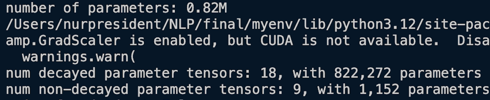

# Proton size MLL


Tiny LLM based on gpt2. Trained using `Dataset Card for KazQAD` [link](https://huggingface.co/datasets/issai/kazqad). By coverting dataset to question answer based sample model ProtonMLL tarined with 



After this attempt still under active development, but currently the file `train.py` reproduces GPT-2 (124M) on OpenWebText. OpenAi's smallest sample data. It have been over 8 days but model still running

loss:


The code itself is plain and readable: `train.py` is a ~300-line boilerplate training loop and `model.py` a ~300-line GPT model definition, which can optionally load the GPT-2 weights from OpenAI    (All open source based)


## install

```
pip install torch numpy transformers datasets tiktoken wandb tqdm
```

Dependencies:

- [pytorch](https://pytorch.org) <3
- [numpy](https://numpy.org/install/) <3
-  `transformers` for huggingface transformers <3 (to load GPT-2 checkpoints)
-  `datasets` for huggingface datasets <3 (if you want to download + preprocess OpenWebText)
-  `tiktoken` for OpenAI's fast BPE code <3
-  `wandb` for optional logging <3
-  `tqdm` for progress bars <3

## quick start

If you are not a deep learning professional and you just want to feel the magic and get your feet wet, the fastest way to get started is to train a character-level GPT on the works of qazdata. First, we download it as a single (1MB) file and turn it from raw text into one large stream of integers:

```
$ python data/qazdata_char/prepare.py
```

This creates a `train.bin` and `val.bin` in that data directory. Now it is time to train your GPT. The size of it very much depends on the computational resources of your system:


**I only have a macbook** Apple silicon M1 not good choice to that one. But after making few changes in M3 Pro i got upgrade in acceleration. However that was my work laptop `¯\_(ツ)_/¯`

```
$ python train.py config/train_qazdata_char.py --device=cpu --compile=False --eval_iters=20 --log_interval=1 --block_size=64 --batch_size=12 --n_layer=4 --n_head=4 --n_embd=128 --max_iters=2000 --lr_decay_iters=2000 --dropout=0.0
```

Here, since we are running on CPU instead of GPU we must set both `--device=cpu` and also turn off PyTorch 2.0 compile with `--compile=False`. Then when we evaluate we get a bit more noisy but faster estimate (`--eval_iters=20`, down from 200), our context size is only 64 characters instead of 256, and the batch size only 12 examples per iteration, not 64. We'll also use a much smaller Transformer (4 layers, 4 heads, 128 embedding size), and decrease the number of iterations to 2000 (and correspondingly usually decay the learning rate to around max_iters with `--lr_decay_iters`). Because our network is so small we also ease down on regularization (`--dropout=0.0`). This still runs in about ~3 minutes, but gets us a loss of only 1.88 and therefore also worse samples, but it's still good fun:

```
$ python sample.py --out_dir=out-qazdata-char --device=cpu
```
Generates samples like this:

```
Амазонка бассейні картада кайда орналаскан? :
Тембесті тасинтерметтерген пайдалдын

Алгашккы жане деп кім болды? :
Джол
```


Finally, on Apple Silicon Macbooks and with a recent PyTorch version make sure to add `--device=mps` (short for "Metal Performance Shaders"); PyTorch then uses the on-chip GPU that can *significantly* accelerate training (2-3X) and allow you to use larger networks..


to ask spesific question:

```
$ python sample.py --out_dir=out-qazdata-char --device=cpu --start="Амазонка бассейні картада қайда орналасқан?:" --num_samples=1 --max_new_tokens=100 
```

## reproducing GPT-2

A more serious deep learning professional may be more interested in reproducing GPT-2 results. So here we go - we first tokenize the dataset, in this case the [OpenWebText](https://openwebtext2.readthedocs.io/en/latest/), an open reproduction of OpenAI's (private) WebText:

```
$ python data/openwebtext/prepare.py
```

This downloads and tokenizes the [OpenWebText](https://huggingface.co/datasets/openwebtext) dataset. It will create a `train.bin` and `val.bin` which holds the GPT2 BPE token ids in one sequence, stored as raw uint16 bytes. Then we're ready to kick off training. To reproduce GPT-2 (124M) you'll want at least an 8X A100 40GB node and run:

```
$ torchrun --standalone --nproc_per_node=8 train.py config/train_gpt2.py
```

This will run for about 4 days using PyTorch Distributed Data Parallel (DDP) and go down to loss of ~2.85. Now, a GPT-2 model just evaluated on OWT gets a val loss of about 3.11, but if you finetune it it will come down to ~2.85 territory (due to an apparent domain gap), making the two models ~match.

If you're in a cluster environment and you are blessed with multiple GPU nodes you can make GPU go brrrr e.g. across 2 nodes like:

```
Run on the first (master) node with example IP 123.456.123.456:
$ torchrun --nproc_per_node=8 --nnodes=2 --node_rank=0 --master_addr=123.456.123.456 --master_port=1234 train.py
Run on the worker node:
$ torchrun --nproc_per_node=8 --nnodes=2 --node_rank=1 --master_addr=123.456.123.456 --master_port=1234 train.py
```

It is a good idea to benchmark your interconnect (e.g. iperf3). In particular, if you don't have Infiniband then also prepend `NCCL_IB_DISABLE=1` to the above launches. Your multinode training will work, but most likely _crawl_. By default checkpoints are periodically written to the `--out_dir`. We can sample from the model by simply `$ python sample.py`.

Finally, to train on a single GPU simply run the `$ python train.py` script. Have a look at all of its args, the script tries to be very readable, hackable and transparent. You'll most likely want to tune a number of those variables depending on your needs.

## baselines

OpenAI GPT-2 checkpoints allow us to get some baselines in place for openwebtext. We can get the numbers as follows:

```
$ python train.py eval_gpt2
$ python train.py eval_gpt2_medium
$ python train.py eval_gpt2_large
$ python train.py eval_gpt2_xl
```

and observe the following losses on train and val:

| model | params | train loss | val loss |
| ------| ------ | ---------- | -------- |
| gpt2 | 124M         | 3.11  | 3.12     |
| gpt2-medium | 350M  | 2.85  | 2.84     |
| gpt2-large | 774M   | 2.66  | 2.67     |
| gpt2-xl | 1558M     | 2.56  | 2.54     |

However, we have to note that GPT-2 was trained on (closed, never released) WebText, while OpenWebText is just a best-effort open reproduction of this dataset. This means there is a dataset domain gap. Indeed, taking the GPT-2 (124M) checkpoint and finetuning on OWT directly for a while reaches loss down to ~2.85. This then becomes the more appropriate baseline w.r.t. reproduction.

## finetuning

Finetuning is no different than training, we just make sure to initialize from a pretrained model and train with a smaller learning rate. For an example of how to finetune a GPT on new text go to `data/qazdata` and run `prepare.py` to download the tiny qazdata dataset and render it into a `train.bin` and `val.bin`, using the OpenAI BPE tokenizer from GPT-2. Unlike OpenWebText this will run in seconds. Finetuning can take very little time, e.g. on a single GPU just a few minutes. Run an example finetuning like:

```
$ python train.py config/finetune_qazdata.py
```

This will load the config parameter overrides in `config/finetune_qazdata.py` (I didn't tune them much though). Basically, we initialize from a GPT2 checkpoint with `init_from` and train as normal, except shorter and with a small learning rate. If you're running out of memory try decreasing the model size (they are `{'gpt2', 'gpt2-medium', 'gpt2-large', 'gpt2-xl'}`) or possibly decreasing the `block_size` (context length). The best checkpoint (lowest validation loss) will be in the `out_dir` directory, e.g. in `out-qazdata` by default, per the config file. You can then run the code in `sample.py --out_dir=out-qazdata`:

```
THEODORE:
Thou shalt sell me to the highest bidder: if I die,
I sell thee to the first; if I go mad,
I sell thee to the second; if I
lie, I sell thee to the third; if I slay,
I sell thee to the fourth: so buy or sell,
I tell thee again, thou shalt not sell my
possession.

JULIET:
And if thou steal, thou shalt not sell thyself.

THEODORE:
I do not steal; I sell the stolen goods.

THEODORE:
Thou know'st not what thou sell'st; thou, a woman,
Thou art ever a victim, a thing of no worth:
Thou hast no right, no right, but to be sold.
```

Whoa there, GPT, entering some dark place over there. I didn't really tune the hyperparameters in the config too much, feel free to try!

## sampling / inference

Use the script `sample.py` to sample either from pre-trained GPT-2 models released by OpenAI, or from a model you trained yourself. For example, here is a way to sample from the largest available `gpt2-xl` model:

```
$ python sample.py \
    --init_from=gpt2-xl \
    --start="What is the answer to life, the universe, and everything?" \
    --num_samples=5 --max_new_tokens=100
```

If you'd like to sample from a model you trained, use the `--out_dir` to point the code appropriately. You can also prompt the model with some text from a file, e.g. `$ python sample.py --start=FILE:prompt.txt`.